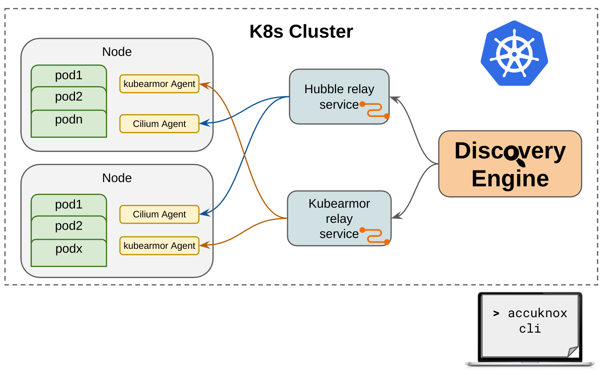

# Discovery Engine

Discovery Engine discovers the security posture for your workloads and auto-discovers the policy-set required to put the workload in least-permissive mode.
The engine leverages the rich visibility provided by [KubeArmor](https://github.com/kubearmor/kubearmor) and [Cilium](https://github.com/cilium/cilium) to auto discover the systems and network security posture.

<p align="center">  </p>

# Getting Started Guide

<p align="center">  </p>

## Quick Install
```
kubectl apply -f https://raw.githubusercontent.com/accuknox/discovery-engine/dev/deployments/k8s/deployment.yaml
```
The discovery engine will automatically connect to the kubearmor and cilium agents installed in `kube-system` namespace. Discovery engine can connect to either or both the engines and provide necessary insights into the workloads.

## Get the discovered policies
Use `karmor discover --help` to check all the options. To install karmor cli tool follow the link [here](https://github.com/kubearmor/kubearmor-client/#from-script).

Example, Get policies discovered for deployment having label `"app=wordpress"` in `wordpress-mysql` namespace.
```
karmor discover -n wordpress-mysql -l "app=wordpress" -f yaml > wordpress.yaml
```
The `wordpress.yaml` can then be used to enforce policies using kubearmor by using `kubectl apply -f wordpress.yaml`.

### Uninstall
```
kubectl delete -f https://raw.githubusercontent.com/accuknox/discovery-engine/dev/deployments/k8s/deployment.yaml
```
</details>

### Want to do more with the discovered policies?

The discovered policies contains the execution posture for your workloads. You can use these policies to check what the workloads are doing. Check [this guide](getting-started/filter_and_vis.md) to know more.

### Others
1. [Detailed functionality overview](getting-started/detailed_overview.md)
1. [Types of policies discovered](getting-started/detailed_overview.md#types-of-policies-discovered-by-the-engine)

