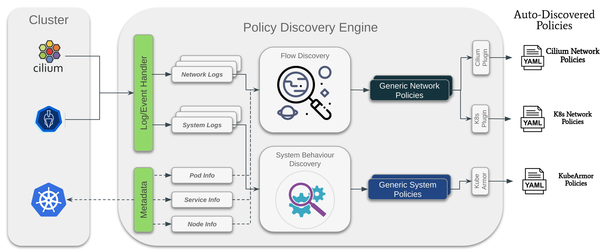

# Functionality Overview

The Discovery engine discovers network and system policies based on the collected network and system logs respectively from the various container network interfaces (CNI) such as [Cilium](https://github.com/cilium/cilium/) and [KubeArmor](https://github.com/kubearmor/kubearmor).

Auto Policy Discovery operates as plug-ins because each CNI and CRSE employ their own scheme for the network log/policy and system log/policy. The engine discovers a generic policy (network log/policy and system log/policy) and then employs converter adapter to convert it to KubeArmorPolicy or CiliumNetworkPolicy. The aim is to minimize the dependency on CNI, CRSE specific quirks.

Auto Policy Discovery is designed for Kubernetes environments; it focuses on pods/services, and its fundamental principle is to produce a minimal network and system policy set covering maximum behavior. To do this, we actively use the label information assigned from the Kubernetes workloads/resources.

* Produce a minimum policy set covering maximum flows

The Discovery engine aggregates multiple network and system flows together to generate a minimal set of policies covering all the flows. One of the aim is to ensure that the policies use the higher level abstraction in the form of namespace, labels as provided by k8s orchestration engine for policy discovery.

* Identify overlapped policies

Considering external destinations, the discovery engine builds CIDR or FQDN-based policies, and to do this it takes two steps. First, if the engine comes across the external IP address as the destination, it tries to convert the IP address to the domain name by leveraging the reverse domain services. Next, if it fails to find the domain name, it retrieves the domain name from an internal map that matches the domain name to the IP address collected by DNS query and response packets from the kube-dns traffic. Thus, building FQDN based policies has a higher priority than CIDR policies.

Inevitably, CIDR policies could be discovered if there is no information on the matched domain names. However, if we build an FQDN policy that overlaps the prior CIDR policy, the discovery engine can tag and update those policies so that we can maintain the latest network policies.

* Operate in runtime or on the collected logs in advance

Generally, the engine discovers the network policies by extracting the network logs from the database every time intervals. In addition, the engine can connect to a log monitor directly (e.g., Cilium Hubble), and receive the network log, and then produce the network policies in runtime.

## Types of policies discovered by the engine

1. For Application/System (based on [KubeArmor](https://github.com/kubearmor/kubearmor))
	1. File System Access based policies: What processes are accessing what file system paths?
	1. Process based policies: What processes are spawned in the pods/containers?
	1. Network based policies: What processes are using what protocols (TCP/UDP/Raw/ICMP)?
1. For Network (based on [Cilium](https://github.com/cilium/cilium))
	1. L3/L4 Ingress/Egress
	1. L7 Ingress/Egress (based on L7 visibility provided by Cilium)
	1. FQDN based policies
	1. TCP/UDP protocol based policies
	1. Kubernetes Service based policies
	1. CIDR based policies
