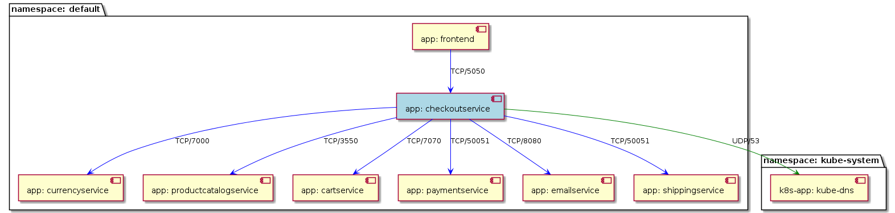
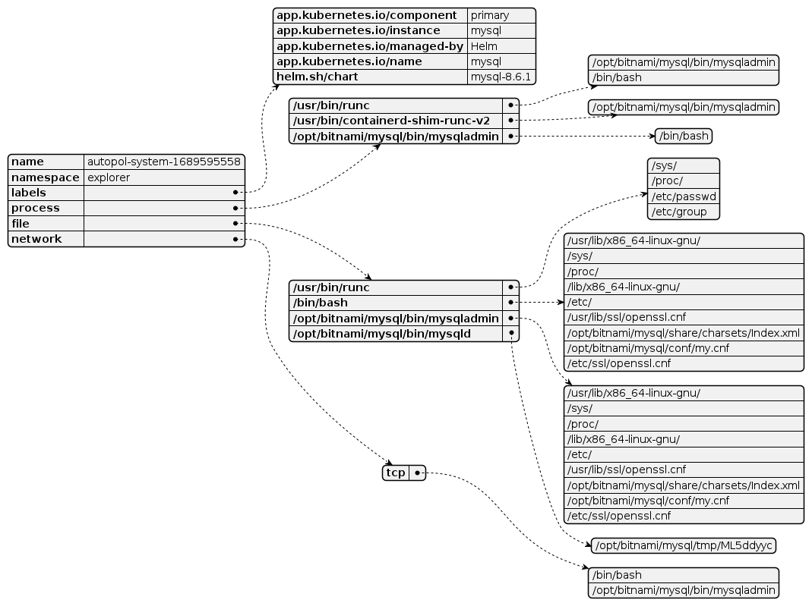

# Filtering and Visualization of discovered policies

The discovered policies contains the execution posture for your workloads. You can use these policies to:
1. check what the workloads are doing from application perspective
1. check deployment interconnectivity
1. filter policies in the context of given namespace or deployment

Download `filter-policy` tool:
```
curl -O https://raw.githubusercontent.com/accuknox/tools/main/filter-policy && chmod +x filter-policy
```

## Network visualization of a given deployment

```
./filter-policy -f cilium_policies.yaml -l '^app: checkoutservice' -g checkoutservice.png -o checkoutservice.yaml
```



## System visualization of a given deployment

```
./filter-policy -f kubearmor_policies_default_explorer_mysql_yoebymtp.yaml -g mysql.png
```



